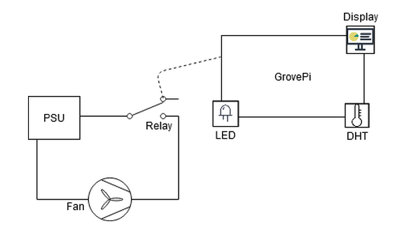
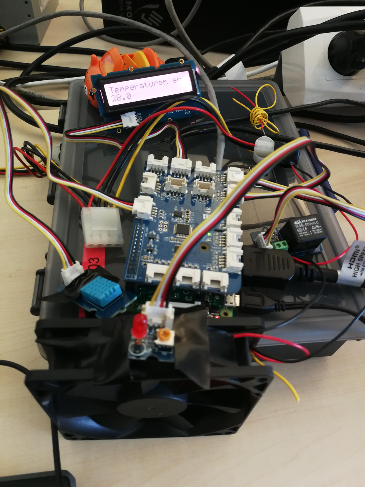

# Computerteknologi HF1 - Klimaanlæg
<div align="right">
	<sub>
		Mark Pedersen & Mads Finseth 18-06-2020
		<br/>
		Redigeret til Github af Mads 26-07-2020
	</sub>
</div>

## Projektbeskrivelse:
Vi har lavet et klimaanlæg, hvor en blæser sætter i gang hvis temperaturen er over 28C.

Vores projekt består af følgende komponenter:

- GrovePi
- Raspberry Pi Model B Rev 1.2
- Strømforsyning (PSU)
- 12V kabinet-blæser
- GrovePi Relay
- GrovePi DHT11
- GrovePi LED
- GrovePi Display.

<br/>

1 stk. blæser forbundet til en strømforsyning.

En temperaturføler som aktiverer vores relæ, når temperaturen overstiger 28 C grader.

En LED vil begynde at lyse når blæseren starter. Når temperaturen er under den værdi vi har sat, slukker både blæseren og LED igen.

LED Display som viser temperaturen.



<br/>

## Billede af vores klimaanlæg:

{:class="img-responsive"}

## Vores kode:

```python
# Imports the libraries that we use
import time
from grovepi import *
from grove_rgb_lcd import *

# Sets the port for Grove-Relay @ D4
relay = 4
# Sets the port for Grove-Temp @ D7
sensor = 7
# Sets the port for Grove-LED @ D3
led = 3

# Sets components to Output
pinMode(relay,"OUTPUT")
pinMode(led,"OUTPUT")

# DHT sensor input
blue = 0

# Creates a loop, where we test for the temperature and turns on the fan and LED if the temperature gets above 28C.
while True:
    try:
        [temp,humidity] = dht(sensor,blue)
        
        if math.isnan(temp) == False:
            print(temp)
            setRGB ( 210,55,30 ) # Sets the display colour
            
        if float(temp) > 28.0: # Sets the target temperature
            digitalWrite(relay,1) # When the temperature is above 28C turn on the Relay (fan)
            digitalWrite(led,1) # When the temperature is above 28C turn on the LED
            setText ("Temperaturen er " + str (temp)) # Writes to the Display
            time.sleep(5) # Sets a timer for 5 seconds
        else:
            digitalWrite(relay,0) # When the temperature is below 28C turn off the Relay (fan)
            digitalWrite(led,0) # When the temperature is below 28C turn off the LED
            setText ("Temperaturen er " + str (temp)) # Writes to the Display
            time.sleep(5) # Sets a timer for 5 seconds
               
    except KeyboardInterrupt:  
        digitalWrite(relay,0)  # Turn LED and Relay off before stopping
        digitalWrite(led,0)  # Turn LED and Relay off before stopping       
        break              
    except IOError:
        print ("Error")
```

# Links:
https://gpiozero.readthedocs.io/en/stable/index.html

